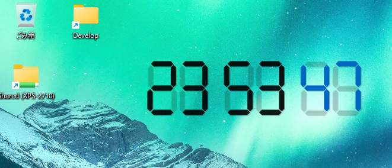
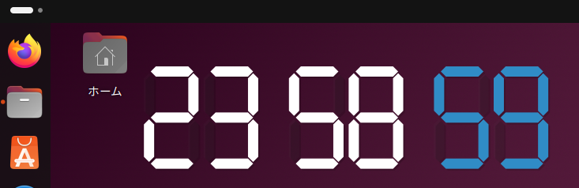

# DigitalClock

**Qt6** で構築され、プロフェッショナルなワークフロー向けにカスタマイズされた、洗練された 透過型デジタル時計です。このプロジェクトは、Qt の古典的な「analogclock」サンプルを現代的に進化させたもので、Gemini との共同開発によって生まれました。

## 主な特徴

* **デスクトップに馴染む UI**: 枠なし（フレームレス）、背景透過、および「常に最前面表示」に対応。Linux デスクトップ上にエレガントに配置できるよう設計されています。

## 操作方法

* **移動**: 任意の場所を左クリックしてドラッグすると、時計を移動できます。
* **サイズ変更**: マウスホイールを使用して UI の拡大・縮小が可能です。
* **色反転**: 任意の場所を右クリックすると、色の反転メニューが表示されます。

## 技術詳細

* **フレームワーク**: Qt 6.11 (Linux), Qt 6.8 (Windows)
* **グラフィックス**: アンチエイリアスを効かせた QPainter と `WA_TranslucentBackground` を使用。

## スクリーンショット

